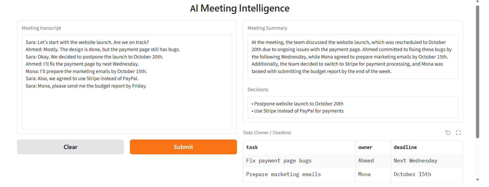
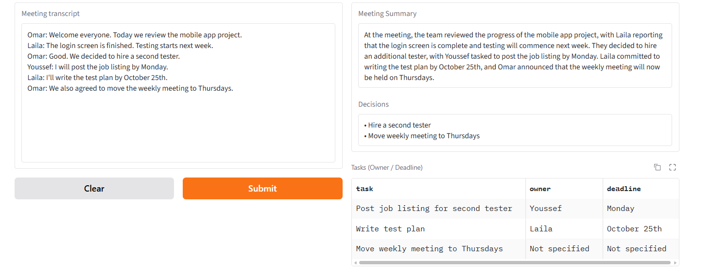
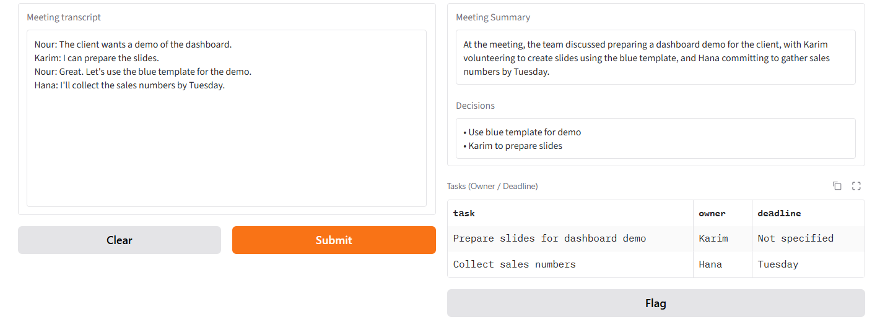

# 🚀 [Tips Hindawi](https://www.tipshindawi.com/) Internship (August–October) 2026

> 🎓 This project was built during the [ **Tips Hindawi** ](https://www.tipshindawi.com/) **Internship (August–October) 2026**.

## 👤 Participant

| Field            | Value                                |
| ---------------- | ------------------------------------ |
| Full Name        | Hanya Ibrahim Aref Mohamed           |
| Project Name     | AI Meeting Intelligence              |
| GitHub Username  | Hanyaibrahim                         |
| Internship Batch | August–October 2026                  |
| Training Program | Large Language Models (LLMs) Program |
| Organization     | [**Edrak for Ai**](https://edrak4ai.com/en) |

---

# 📖 Project Overview

**AI Meeting Intelligence** analyzes meeting transcripts automatically. You paste a transcript, and the system returns a short summary, the decisions that were made, and a table of action items with the **owner** and **deadline** of each task.

The project uses a chain of three prompts running on **Mistral-Nemo-Instruct-2407**. Each prompt handles one job (summary, decisions, tasks). The task output is parsed and validated with **Pydantic**, then shown in a **Gradio** web interface.

---

# ✨ Features

* **Meeting summary:** a short, plain-prose paragraph of the main topics and outcomes.
* **Decision extraction:** a list of the decisions the group agreed on.
* **Task extraction:** action items with owner and deadline, shown in a table.
* **Missing information handling:** if a task has no owner or deadline, the system writes "Not specified" instead of inventing one.
* **Structured output parsing:** the task JSON is validated with Pydantic, with automatic retries if the model returns malformed JSON.
* **Web interface:** a simple Gradio app with a public share link.

---

# 🛠️ Technologies Used

* Python
* [Mistral-Nemo-Instruct-2407](https://huggingface.co/mistralai/Mistral-Nemo-Instruct-2407) (LLM)
* Hugging Face Transformers
* PyTorch
* Pydantic (output parsing and validation)
* Gradio (user interface)
* Pandas
* Kaggle Notebooks (GPU T4 ×2)

---

# ⚙️ Installation

The project runs on a **Kaggle notebook**, because the 12B model needs a GPU.

1. Sign in to [Kaggle](https://www.kaggle.com/) and create a new notebook.
2. Upload `AI_Meeting_Intelligence.ipynb` (**File → Import notebook**).
3. In the notebook settings, set:
   * **Accelerator:** GPU T4 ×2
   * **Internet:** On
4. Install the dependencies (the first cell of the notebook does this):

```bash
pip install -q transformers==4.52.4 gradio pydantic pandas
```

You can also install from the requirements file:

```bash
pip install -r requirements.txt
```

---

# 🚀 Usage

1. Run the notebook cells **in order, top to bottom**:
   1. Install libraries
   2. Load the model (takes about 5–15 minutes the first time)
   3. Define the model call
   4. Define the output structure (Pydantic classes)
   5. Define the three chain functions
   6. Define the parsing functions
   7. Test with a sample transcript
   8. Launch the Gradio interface
2. Open the **public Gradio link** (ending in `gradio.live`) printed by the last cell.
3. Paste a meeting transcript into the text box and click **Submit**.
4. After 10–20 seconds you get the summary, decisions, and tasks table.

Sample transcripts to try are in [`sample_transcripts.txt`](sample_transcripts.txt).

### How it works

```
Transcript
    ├── Prompt 1: Summarize          → Summary
    ├── Prompt 2: Extract decisions  → Decisions
    └── Prompt 3: Extract tasks      → JSON → Pydantic validation → Tasks table
```

---

# 📸 Demo

### Transcript 1: Website launch


### Transcript 2: Mobile app project


### Transcript 3: Dashboard demo (missing deadline)


---

# 📈 Results

The system was tested on three sample transcripts with different structures.

| Transcript | Summary | Decisions | Tasks | Notes |
| --- | --- | --- | --- | --- |
| 1: Website launch | Correct, but deadlines paraphrased loosely | 2/2 correct | 3/3 correct | Deadlines in the table are exact |
| 2: Mobile app project | Correct | 2/2 correct | 2/2 correct | |
| 3: Dashboard demo | Correct | 1/2 (a task was listed as a decision) | 2/2 correct | Missing deadline correctly marked "Not specified" |

**Highlights**

* Owners and deadlines in the tasks table were correct in all three tests.
* The system did not invent a deadline when none was given.
* Splitting the work into three focused prompts gave more reliable output than one large prompt.

**Known limitations**

* The summary can paraphrase deadlines loosely (for example "the following Wednesday").
* The model can occasionally list a task as a decision (seen in transcript 3).
* Small models sometimes return malformed JSON; this is handled with retries but is not guaranteed.
* The Kaggle session and the Gradio share link are temporary.
* Tested on English transcripts only.

---

# 🔮 Future Improvements

* Upload audio and transcribe it automatically with Whisper.
* Stricter decision detection to avoid mixing decisions and tasks.
* Export the meeting report to PDF or Word.
* Arabic transcript support.
* Permanent deployment on Hugging Face Spaces.

---

# 📚 About the Internship

This project was developed as part of the [**Tips Hindawi**](https://www.tipshindawi.com/) **Internship (August–October) 2026**, and it will be showcased on the official [Tips Hindawi](https://www.tipshindawi.com/) website.

[Tips Hindawi](https://www.tipshindawi.com/) is the internships department of [**Edrak for Ai**](https://edrak4ai.com/en), and the internship encourages participants to build real-world projects, apply practical skills, and showcase their work through GitHub.

For more information about the internship, training programs, and upcoming batches, visit the official [Tips Hindawi](https://www.tipshindawi.com/) website.

---

# 📄 License

This project is shared for educational and portfolio purposes.
